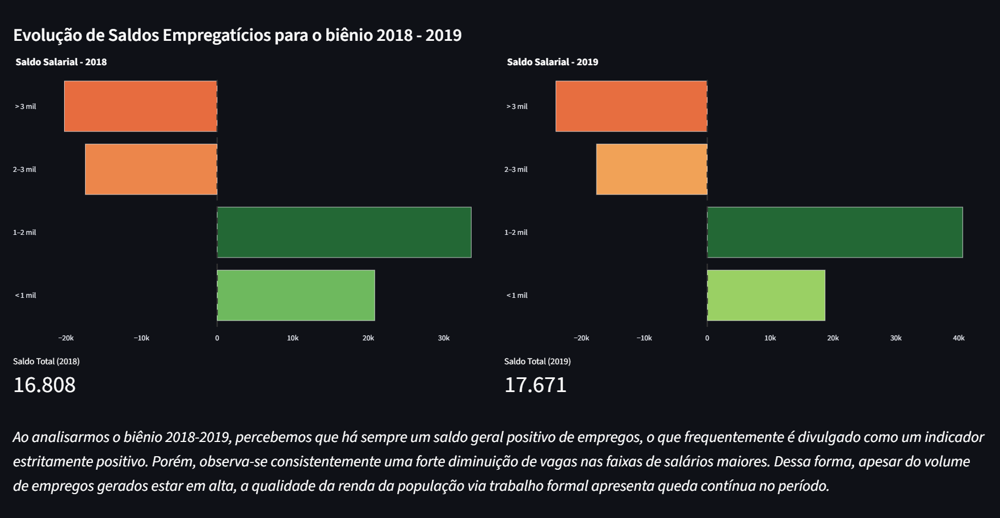

# Relatório

## Identificação

- **Nome**: Kauan Karlinski Rakoski
- **Cartão UFRGS:** 00588935

## Dados utilizados

1. **Dataset CAGED**: <https://basedosdados.org/dataset/562b56a3-0b01-4735-a049-eeac5681f056?table=95106d6f-e36e-4fed-b8e9-99c41cd99ecf>
    * **Descrição curta**: cadastro geral de empregados e desempregados. Conjunto de dados que versa sobre admissões e desligamentos, salários, horas, sexo e região. O foco foi analisar o saldo de admissões, desligamentos e o salário para o Rio Grande do Sul nos anos 2018 e 2019. 
    O arquivo principal contém vários gráficos, para fazer uma análise exploratória.

## Código-fonte da visualização

- **Arquivo principal**: [graph.py](main.py) - monta os gráficos a partir dos dados
- **Arquivos complementares (se houver)**: [fetch.py](fetch.py) - busca os dados no BigQuery via basedosdados e gera um parquet.

## Imagem da visualização gerada

## Descrição da visualização

### Legenda (*caption*)

Dois gráficos de pirâmide lado a lado, demonstrando o saldo empregatício (admissões - desligamentos) nos anos de 2018 e 2019, respectivamente, separados por faixa de renda. As faixas de renda são menos que mil reais, entre mil e dois mil reais e acima de três mil reais mensais. O salário mínimo nos anos foi respectivamente R$954,00 e R$998,00. 

### Conclusão demonstrada pela visualização

Como posto na legenda da própria figura, a principal conclusão é que, apesar do crescimento de empregos em termos gerais (mais admissões que desligamentos) - dado que é frequentemente citado como exemplo de uma boa gestão -, os cargos com salários maiores diminuiram, de forma que temos mais pessoas empregadas, mas ganhando menos.

Claramente, o gráfico e as conclusões tomadas possuem simplificações, como: 

(i) não consideramos os motivos de admissão/desligamento, até porque não estão presentes no dataset. A diminuição de salários maiores e aumento de menores pode simbolizar aposentadoria de pessoas com cargos altos e admissão de diversos jovens com salários iniciais, por exemplo.

(ii) As faixas condensam bastante dados, a faixa final especificamente. A escolha de 3 mil como "limitante" superior se deve ao fato de que o 75% percentil em 2018 e 2019 era R$ 1.522,00 e 1.578,00, de forma que a maioria dos dados se encontra abaixo deste valor.

(iii) Os dados consideram apenas trabalhadores CLT, não contando o trabalho PJ ou informal.